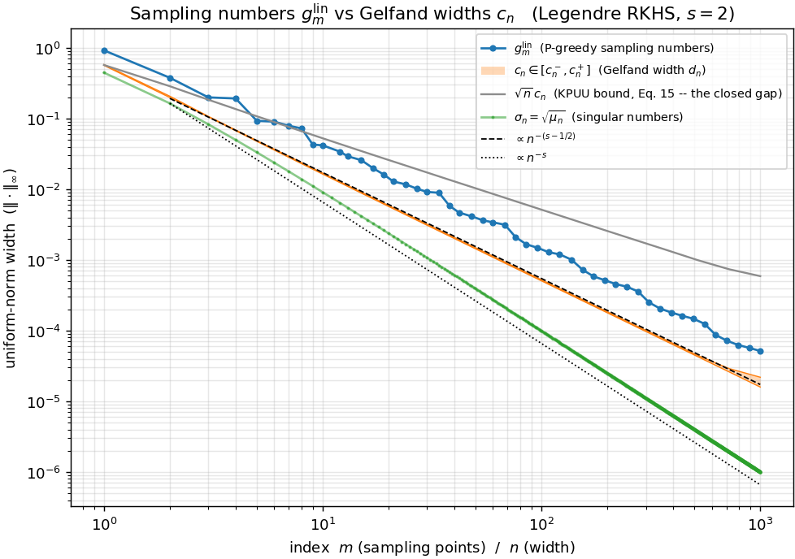
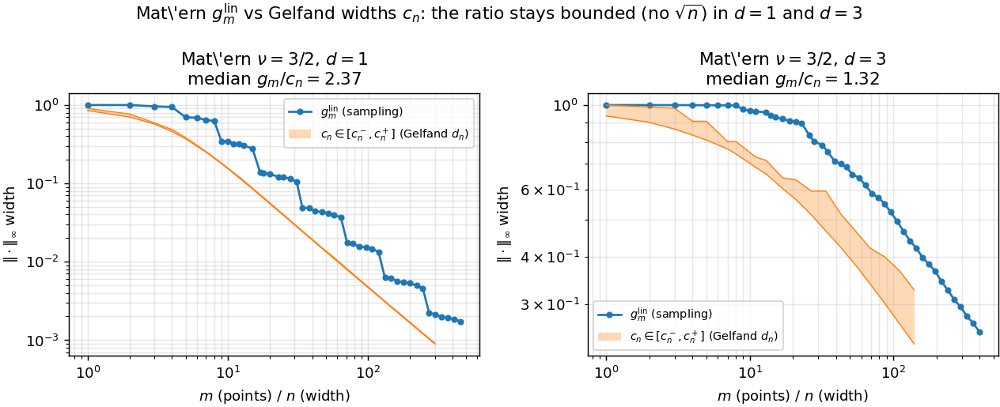
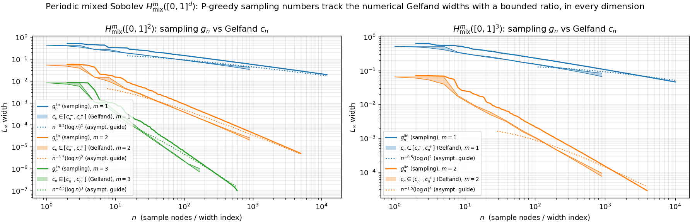
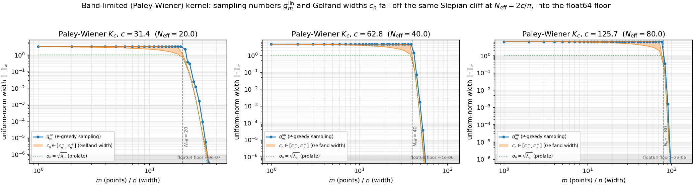

# Sampling numbers vs Gelfand widths — a kernel-RKHS numerical study

Numerical experiments accompanying work by Sebastian Neumayer, Kateryna Pozharska,
and Tino Ullrich on *sampling numbers versus Gelfand widths for optimal recovery in
the uniform norm*. The manuscript itself is not included in this repository.

## The question

For the unit ball of a bounded-kernel RKHS `H(K)` on a domain `D ⊂ R^d`, recovered in
the **uniform norm**, the paper compares two quantities as functions of the budget.
The manuscript's Legendre and Paley–Wiener experiments use `[-1,1]^d`; its periodic
mixed-Sobolev experiment uses the torus represented by `[0,1]^d`. The supplemental
Matérn experiment also uses `[-1,1]^d`.

* **`g_m^lin`** — the *linear sampling numbers* `= inf_{|P|=m} ‖Pow_P‖_∞`, the best
  worst-case error from `m` point samples.
* **`c_n`** — the *Gelfand widths* `= d_n(𝒦)_H`, the Kolmogorov `n`-width of the
  translate set, i.e. the best error from `n` *arbitrary* linear measurements.

**Numerical convention.** The code and figures retain the original sampling-number notation
`g_m^lin` for their numerical estimate, obtained from the power function of one **P-greedy
design** using the exact argmax on a finite candidate grid. This has `γ=1` relative to the
grid. It has `γ=1/2` on the full domain only if the grid resolves the true supremum within
a factor of two, which is not verified numerically. Thus the reported `g_m^lin` values are
constructive upper surrogates, not computations of the exact point-set infimum.

Since point evaluations are a restricted class of functionals, `c_n ≤ g_m^lin` always.
The general bound (KPUU) only gives `g_{2n} ≤ C·√n·c_n`. Under the decay/weight
assumptions of the paper's comparison theorem, the admissible regularly-varying decay
scale transfers from `c_n` to `g_m^lin`, removing this `√n` loss along that scale.
Boundedness of the kernel alone does not imply the pointwise estimate `g_m^lin ≲ c_m`.
The Paley–Wiener experiment is an empirical stress test outside these assumptions, not
an illustration of the comparison theorem.

## What the experiments investigate

The experiments compare the numerical `g_m^lin` estimates with lower/upper values for `c_n`.
They provide evidence that the estimated sampling numbers track the same decay scale in the tested
regimes; they do not solve the global point-set optimization defining the exact `g_m^lin`.

## Files

| file                 | contents                                                              |
|----------------------|-----------------------------------------------------------------------|
| `kernels.py`         | Legendre Mercer `K_s`, Matérn (half-integer `ν`, any `d`), periodic mixed-Sobolev `H^m_mix`, Paley–Wiener sinc `K_c` (band-limited / prolate); stationary kernels expose the rigorous RKHS modulus `dist_bound` the `c_n⁺` certificate needs |
| `greedy.py`          | PyTorch P-greedy (incremental Newton-basis power function)            |
| `widths.py`          | `g_m^lin` sampling-number estimates (P-greedy grid-sup power), `c_n` (numerical Kolmogorov width: IRLS minimax + exchange + certified/estimated sup), driver |
| `legendre.py`        | Legendre example → `legendre.png` (optional diagnostic overlays); P-greedy design → `legendre_points.png` |
| `matern.py`          | supplemental Matérn `ν=3/2` experiment in `d=1,3` → `matern.png`; design → `matern_points.png` |
| `periodic_mixed.py`  | periodic mixed-Sobolev `H^m_mix([0,1]^d)` → `periodic_mixed.png` (optional orbit-tail overlay); design → `periodic_mixed_points.png` |
| `paley_wiener.py`    | band-limited Paley–Wiener/prolate kernel: flat-then-cliff sampling-number estimate and `c_n` at `N_eff=2c/π` → `paley_wiener.png`,  `paley_wiener_points.png` |

## Usage

Requires Python ≥ 3.10 with `numpy`, `scipy`, `torch`, `matplotlib` (see `requirements.txt`);
a CUDA device is used automatically when available, but everything runs on CPU.

```bash
python legendre.py       # Legendre s=2: sampling-vs-Gelfand figure + P-greedy design
python matern.py         # supplemental Matérn ν=3/2 comparison + P-greedy design
python periodic_mixed.py # periodic mixed-Sobolev H^m_mix, d=2,3 -- width band + rate overlay
python paley_wiener.py   # band-limited kernel: the N_eff cliff in float64 + design
```

For a reproducible CPU environment and the fast regression suite:

```bash
conda env create -f environment.yml
conda run -n sampling-numbers pytest -q
```

The four driver commands are publication-scale experiments, not smoke tests. In particular,
`periodic_mixed.py` allocates several gigabytes for its largest greedy systems and is intended
for a CUDA device with comfortable memory headroom; CPU execution is supported but can be slow.
Use the tests for a quick installation check and reduce the grid/node arguments in the driver
functions when exploring interactively.

`sampling_vs_gelfand` returns `cn_certified`, a boolean mask indicating where `cn` is a proven
upper bound. Where it is false, `cn` is an off-grid numerical estimate and the plotted region is
not a certified interval.

Each driver writes `<kernel>.png` (the estimated sampling numbers vs `c_n` comparison) and, where applicable,
`<kernel>_points.png` (the P-greedy design).

### Persistent full-coordinate manuscript run

The three manuscript comparison figures can be generated consecutively with full IRLS
coordinates in the `PyTorch` Conda environment. The launcher runs the worker in a named,
detached `tmux` session, so it survives a lost terminal or SSH connection:

```bash
./launch_manuscript_figures.sh
```

The order is Legendre, periodic mixed-Sobolev, then Paley–Wiener. All calls use
`compress_irls=False`; the first two also use `diagnostic_overlays=False`, while Paley–Wiener
keeps its standard cliff/floor reference annotations. Each launch gets a
timestamped directory under `runs/` containing `run.log`, `status.json`, the worker PID,
the figures, and any returned numerical arrays. After logging back in, inspect the latest
run with:

```bash
./manuscript_run_status.sh
```

While it is running, the status command prints the session name and exact attach command.
To reconnect directly to the latest run's live terminal:

```bash
run_dir="$(cat runs/latest_full_run.txt)"
tmux attach-session -t "$(cat "$run_dir/tmux_session")"
```

If a run failed or the machine restarted, resume its remaining stages in the same directory:

```bash
./launch_manuscript_figures.sh "$(cat runs/latest_full_run.txt)"
```

Completed stages whose figure exists are skipped when resuming.

## Figures

The Matérn panel is supplemental; the other three comparison figures correspond to the manuscript.

| | |
|---|---|
|  |  |
|  |  |

## Method notes

* **Candidate grid is kernel-specific** (`kernel.grid_kind`, consumed by `widths.box_grid`). A
  Chebyshev grid encodes the *arcsine/equilibrium* measure — right only for a **boundary-concentrated
  Mercer** kernel (Legendre, `grid_kind="chebyshev"`). A **stationary** kernel (Matérn, sinc,
  periodic) has no endpoint preference, so its measure is **uniform** (scrambled Sobol,
  `grid_kind="uniform"`, any `d`).
* **`g_m^lin` (numerical estimate)** = the running candidate-grid maximum of `Pow_m(x)` for
  the P-greedy design, not the infimum over all designs. The exact grid argmax has `γ=1` on that
  grid; it has `γ=1/2` on all of `D` only under the unverified factor-two grid
  resolution condition. Its plateau-then-drop staircase for Matérn is the signature of a
  *stationary* kernel (dyadic gap-bisection, quasi-uniform centers), versus the smooth power law of
  the endpoint-clustered Legendre design. Each driver's `points_figure()` (via `greedy.design_figure`)
  plots the resulting design (position vs.
  selection order) — endpoint-clustered for Legendre, quasi-uniform for Matérn.
* **`c_n`** = the Kolmogorov width of the translate set by a **reweighted-SVD (IRLS) minimax with
  a Remez exchange step**: kernel-PCA on the reweighted Gram. The competing
  linear reweight `w ← w·(r² + floor·r²_max)`  with `floor=1` shifts mass towards the worst point.
  Returned as a lower value `c_n⁻` and upper value `c_n⁺`. These form a certified bracket only
  where the upper value is certified; elsewhere the plotted band is numerical uncertainty.

  Every comparison figure uses the same certification-aware convention: `c_n⁻` is a solid edge;
  a certified `c_n⁺` is solid with the usual fill, while an uncertified numerical `c_n⁺` is dashed
  with a lighter fill.

  Width indices are processed in increasing order. The first IRLS run starts from uniform
  weights; each subsequent index is warm-started from the final weights at the preceding index.
  This changes only the dual-ascent trajectory and reduces re-convergence work: every iterate
  still supplies a valid weak-duality lower bound.
  Each pass performs at most `T=20` iterations. It stops earlier when neither the best grid
  residual nor the running dual lower bound improves relatively by `10⁻³` for three consecutive
  iterations, or when the represented residual is exhausted. Since the retained bounds from every
  completed iterate are valid independently, early stopping affects cost and tightness, not validity.
  The manuscript algorithm uses the full Gram coordinates. The repository exposes one switch:
  `compress_irls=True` (the practical driver default) uses only
  `r_n=min(N,3n+100)` dominant coordinates, whereas `compress_irls=False` uses all `N` coordinates
  and follows the manuscript algorithm. Under compression, the lower certificate omits energy
  outside the retained coordinates, making its covariance tail conservative; the upper residual
  retains the full kernel norm `K(x,x)`, so its represented subspace remains feasible. Every
  `rates_figure` function accepts this switch, for example
  `legendre.rates_figure(compress_irls=False)` for a full-coordinate Legendre run.

    * `c_n⁻` (lower) — **rigorous** (the retained-coordinate covariance tail, weak duality),
      so `c_n⁻ ≤ c_n`; coordinate truncation can loosen this bound but cannot raise it above
      the full covariance tail.
    * `c_n⁺` (upper) — wherever the kernel gives a **rigorous modulus** (`dist_bound`, 1D
      stationary; `dist_bound_cell`, Matérn any `d`) a **branch-and-bound certificate**: each
      (hyperrectangle) cell bounded by `r(center) + modulus(halfwidths)`, bisect what exceeds the
      incumbent along its longest axis, prune the rest. Without a modulus — **Legendre** (endpoint
      modulus diverges) and **periodic `d>1`** (orbit-flat residual, but see the exact reference
      below) — `c_n⁺` is a **numerical estimate**: L-BFGS-B multistart from two polished seed sets
      + a disagreement **self-check**, plus the **endpoint sweep** (1D Mercer) for the boundary spike.
    * **exchange** (stationary default): the off-grid residual peaks rejoin the dual set, the basis
      is extended *exactly* by their translates (Nyström update, no re-eigendecomposition), a short
      warm IRLS re-optimizes — iterated for up to `exch_rounds` Remez rounds; `max` of lowers /
      `min` of uppers is kept. For **Legendre** exchange is auto-off (the spike re-emerges at a new offset);
      instead the `c_n` grid gets a **geometric endpoint ladder** (`box_grid(edge_ladder=120)`).
    * **periodic exact reference**: on the full torus the translate set is a translation-group
      orbit, so `c_n² = Σ_{k>n} λ_k` **exactly** at closed cos/sin shells
      (`PeriodicSobolevMixedKernel.gelfand_tails`, overlaid in `periodic_mixed.png`) — ground truth
      against which the numerical values are checked.
    * monotone envelopes: `c_n⁺ ← min_{k≤n} c_k⁺` (**subspace nesting**; certified entries stay
      certificates) and `c_n⁻ ← max_{m≥n} c_m⁻`.
  Kernel-agnostic (needs `kernel.eval`; `dist_bound` → certificate, `feature_map` → Mercer speed,
  `eval_grad` → multistart gradients).
* **P-greedy engine** matches the standard VKOGA implementation to `~1e-8`; it uses the
  efficient incremental power update (`O(N·m²)` total, cached kernel columns), is
  device-agnostic (a CUDA grid runs on GPU), and dtype-threaded.

## Caveats

* **Keep `float64`** (with one audited exception). The incremental power update
  `p ← p − v_n²` cancels badly as `Pow → 0`; `float32` (fast on GPU) is unsafe once the
  tracked widths drop below ~1e-4, and would truncate these curves early. `s=2` keeps
  `Pow²` above the `float64` floor out to `m=1000`; `s ≥ 4` stops near `m≈200`. The **only**
  place `float32` is used is the `H^1_mix` (`m=1`) sampling curve in `periodic_mixed.py`,
  whose error decays slowly (`n^{-1/2}`, staying above ~1e-2 out to `n≈4000`) and never
  approaches the float32 floor — validated to agree with `float64` to **<0.6%** over the
  whole curve, in exchange for a ~16× GPU speedup that buys the large node budget. All
  Gelfand-width computations always run in `float64`.
* **Know which `c_n⁺` you are looking at.** On 1D stationary kernels it is a **branch-and-bound
  certificate** (rigorous up to `certify_tol` and float64 rounding); it reverts to a **resolved
  estimate, not a proof**, exactly where certification is impossible:
  * **Legendre** — no finite endpoint modulus; the estimate leans on the endpoint sweep + the
    `edge_ladder` grid (which fixed the historical `~20%` undershoot: the peak sits within `~3·10⁻⁷`
    of `±1`, the innermost plain-Chebyshev node at `~1/N`).
  * **`d>1` without a cell modulus** (periodic) — multistart L-BFGS-B: too few starts silently
    under-resolves the sup, so `c_n⁺` can drop *below* the true value; the orbit spectral tail
    provides a rigorous lower reference and is exact at closed shells. Matérn `d>1` has a rigorous
    cell modulus (`dist_bound_cell`), but certification still depends on the evaluation budget: the
    current 500,000-evaluation `d=3` run reports 0/19 certified uppers, so those values remain
    numerical indicators. Raise `certify_evals` and check `cn_certified` for proof-oriented runs.
  * **at the float64 noise floor** (band-limited kernel past `N_eff`) no budget certifies;
    `gelfand_widths` warns and falls back to its dense-scan best (the floored values carry no
    information anyway).
  `refine=False` reverts to the grid-max upper bound (no certificate/exchange; under-resolves at
  large `n`).
